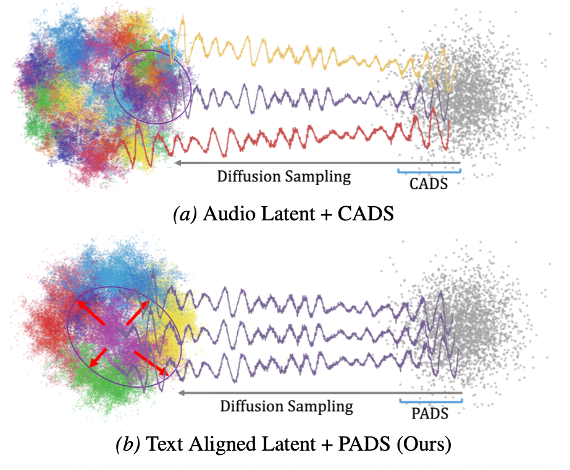

<!-- Using HTML to center the abstract -->

    

        <h2>Abstract</h2>
        

Text-to-Music diffusion models are increasingly used in real-world applications, yet deployment remains challenging: generations can collapse to limited patterns despite diverse initial noise and prompts, and inference-time diversity control often harms prompt alignment and fidelity by distorting key prompt cues established in early denoising.
We propose Padding-Annealed Diffusion Sampling, which perturbs only a padding-indexed subspace while keeping non-padding conditioning fixed, enabling controlled exploration with reduced semantic drift.
Still, in a text-unaware latent space, such exploration is less likely to stay within genre-faithful neighborhoods, limiting genre-consistent diversity. We therefore introduce Text-Aligned Latent, a text-aware VAE latent space that aligns local neighborhoods with text-implied global semantics. 
Together, the two techniques form a unified pipeline that, compared to prior full-conditioning perturbation, achieves a better text-alignment–diversity trade-off: at comparable text alignment, it delivers 15.4% higher diversity with a relatively small fidelity drop, and further improves within-genre diversity by 71.6%.
        

    

  

## Audio Examples
> **Baseline:** Limited diversity despite high audio quality, with occasional genre mismatch.  
> **CADS:** Enhanced diversity but degraded audio quality, suffering from semantic drift.  
> **PADS (Ours):** Achieves rich diversity and high audio quality while maintaining strict genre consistency.

### Task 1: [Samples with single Prompts & Fixed Initial Noise]
**Notice:** All samples are generated twice using the same intial seed; however, the intial seed differs across prompts.

<table>
  <tr>
    <th>Prompt</th>     
    <th>Baseline</th>     
    <th>PADS (Ours)</th>     
    <th>CADS</th>
  </tr>
  <tr>
    <td><b>tropical house, drums, 105 bpm, dance</b></td>
    <td>
      <audio controls controlsList="nodownload" oncontextmenu="return false;" style="width: 200px;">
        <source src="static/audio_samples/TAL-Original/task3/1_-1234_mmvae-origin_1.mp3" type="audio/mpeg">
        Your browser does not support the audio element.
      </audio>
       
      <audio controls controlsList="nodownload" oncontextmenu="return false;" style="width: 200px;">
        <source src="static/audio_samples/TAL-Original/task3/1_-1234_mmvae-origin_2.mp3" type="audio/mpeg">
        Your browser does not support the audio element.
      </audio>
    </td>
    <td>
      <audio controls controlsList="nodownload" oncontextmenu="return false;" style="width: 200px;">
        <source src="static/audio_samples/TAL-PADS/task3/1_-1234_mmvae-pads_4.mp3" type="audio/mpeg">
        Your browser does not support the audio element.
      </audio>
       
      <audio controls controlsList="nodownload" oncontextmenu="return false;" style="width: 200px;">
        <source src="static/audio_samples/TAL-PADS/task3/1_-1234_mmvae-pads_6.mp3" type="audio/mpeg">
        Your browser does not support the audio element.
      </audio>
    </td>
    <td>
      <audio controls controlsList="nodownload" oncontextmenu="return false;" style="width: 200px;">
        <source src="static/audio_samples/TAL-CADS/task3/1_-1234_mmvae-cads_1.mp3" type="audio/mpeg">
        Your browser does not support the audio element.
      </audio>
       
      <audio controls controlsList="nodownload" oncontextmenu="return false;" style="width: 200px;">
        <source src="static/audio_samples/TAL-CADS/task3/1_-1234_mmvae-cads_3.mp3" type="audio/mpeg">
        Your browser does not support the audio element.
      </audio>
    </td>
  </tr>
  <tr>
    <td><b>groove, 125 bpm, dance, upbeat, happy, musical instrument</b></td>
    <td>
      <audio controls controlsList="nodownload" oncontextmenu="return false;" style="width: 200px;">
        <source src="static/audio_samples/TAL-Original/task3/5_1_-7445_mmvae-origin_1.mp3" type="audio/mpeg">
        Your browser does not support the audio element.
      </audio>
       
      <audio controls controlsList="nodownload" oncontextmenu="return false;" style="width: 200px;">
        <source src="static/audio_samples/TAL-Original/task3/5_1_-7445_mmvae-origin_2.mp3" type="audio/mpeg">
        Your browser does not support the audio element.
      </audio>
    </td>
    <td>
      <audio controls controlsList="nodownload" oncontextmenu="return false;" style="width: 200px;">
        <source src="static/audio_samples/TAL-PADS/task3/5_1_-7445_mmvae-pads_1.mp3" type="audio/mpeg">
        Your browser does not support the audio element.
      </audio>
       
      <audio controls controlsList="nodownload" oncontextmenu="return false;" style="width: 200px;">
        <source src="static/audio_samples/TAL-PADS/task3/5_1_-7445_mmvae-pads_2.mp3" type="audio/mpeg">
        Your browser does not support the audio element.
      </audio>
    </td>
    <td>
      <audio controls controlsList="nodownload" oncontextmenu="return false;" style="width: 200px;">
        <source src="static/audio_samples/TAL-CADS/task3/5_1_-7445_mmvae-cads_1.mp3" type="audio/mpeg">
        Your browser does not support the audio element.
      </audio>
       
      <audio controls controlsList="nodownload" oncontextmenu="return false;" style="width: 200px;">
        <source src="static/audio_samples/TAL-CADS/task3/5_1_-7445_mmvae-cads_2.mp3" type="audio/mpeg">
        Your browser does not support the audio element.
      </audio>
    </td>
  </tr>
  <tr>
    <td><b>timpani, soundtrack, 125 bpm, soothing, ambient</b></td>
    <td>
      <audio controls controlsList="nodownload" oncontextmenu="return false;" style="width: 200px;">
        <source src="static/audio_samples/TAL-Original/task3/4_42_mmvae-origin_1.mp3" type="audio/mpeg">
        Your browser does not support the audio element.
      </audio>
       
      <audio controls controlsList="nodownload" oncontextmenu="return false;" style="width: 200px;">
        <source src="static/audio_samples/TAL-Original/task3/4_42_mmvae-origin_2.mp3" type="audio/mpeg">
        Your browser does not support the audio element.
      </audio>
    </td>
    <td>
      <audio controls controlsList="nodownload" oncontextmenu="return false;" style="width: 200px;">
        <source src="static/audio_samples/TAL-PADS/task3/4_42_mmvae-pads_2.mp3" type="audio/mpeg">
        Your browser does not support the audio element.
      </audio>
       
      <audio controls controlsList="nodownload" oncontextmenu="return false;" style="width: 200px;">
        <source src="static/audio_samples/TAL-PADS/task3/4_42_mmvae-pads_3.mp3" type="audio/mpeg">
        Your browser does not support the audio element.
      </audio>
    </td>
    <td>
      <audio controls controlsList="nodownload" oncontextmenu="return false;" style="width: 200px;">
        <source src="static/audio_samples/TAL-CADS/task3/4_42_mmvae-cads_3.mp3" type="audio/mpeg">
        Your browser does not support the audio element.
      </audio>
       
      <audio controls controlsList="nodownload" oncontextmenu="return false;" style="width: 200px;">
        <source src="static/audio_samples/TAL-CADS/task3/4_42_mmvae-cads_8.mp3" type="audio/mpeg">
        Your browser does not support the audio element.
      </audio>
    </td>
  </tr>
  <tr>
    <td><b>piano, 100 bpm, double bass, light, calm</b></td>
    <td>
      <audio controls controlsList="nodownload" oncontextmenu="return false;" style="width: 200px;">
        <source src="static/audio_samples/TAL-Original/task3/7_-1234_mmvae-origin_1.mp3" type="audio/mpeg">
        Your browser does not support the audio element.
      </audio>
       
      <audio controls controlsList="nodownload" oncontextmenu="return false;" style="width: 200px;">
        <source src="static/audio_samples/TAL-Original/task3/7_-1234_mmvae-origin_2.mp3" type="audio/mpeg">
        Your browser does not support the audio element.
      </audio>
    </td>
    <td>
      <audio controls controlsList="nodownload" oncontextmenu="return false;" style="width: 200px;">
        <source src="static/audio_samples/TAL-PADS/task3/7_-1234_mmvae-pads_1.mp3" type="audio/mpeg">
        Your browser does not support the audio element.
      </audio>
       
      <audio controls controlsList="nodownload" oncontextmenu="return false;" style="width: 200px;">
        <source src="static/audio_samples/TAL-PADS/task3/7_-1234_mmvae-pads_4.mp3" type="audio/mpeg">
        Your browser does not support the audio element.
      </audio>
    </td>
    <td>
      <audio controls controlsList="nodownload" oncontextmenu="return false;" style="width: 200px;">
        <source src="static/audio_samples/TAL-CADS/task3/7_-1234_mmvae-cads_1.mp3" type="audio/mpeg">
        Your browser does not support the audio element.
      </audio>
       
      <audio controls controlsList="nodownload" oncontextmenu="return false;" style="width: 200px;">
        <source src="static/audio_samples/TAL-CADS/task3/7_-1234_mmvae-cads_3.mp3" type="audio/mpeg">
        Your browser does not support the audio element.
      </audio>
    </td>
  </tr>
  
</table>

---

[main]: static/image/Figure6.png

### Task 2: [Samples with single Prompts & Random Initial Noise]

#### Input Prompt 1: lofi, chill, vinyl noise, mellow, soft drums, warm chords, nostalgic

<table style="border-collapse: collapse;">
  <tr>
    <th>Baseline</th>
    <th>PADS-TAL (Ours)</th>
    <th>CADS</th>
  </tr>
  <tr style="border: none;">
    <td style="border: none;">
      <audio controls controlsList="nodownload" oncontextmenu="return false;" style="width: 200px;">
        <source src="static/audio_samples/SAO-Original/task1/1115_0.mp3" type="audio/mpeg">
        Your browser does not support the audio element.
      </audio>
    </td>
    <td style="border: none;">
      <audio controls controlsList="nodownload" oncontextmenu="return false;" style="width: 200px;">
        <source src="static/audio_samples/TAL-PADS/task1/1115_3.mp3" type="audio/mpeg">
        Your browser does not support the audio element.
      </audio>
    </td>
    <td style="border: none;">
      <audio controls controlsList="nodownload" oncontextmenu="return false;" style="width: 200px;">
        <source src="static/audio_samples/SAO-CADS/task1/1115_3.mp3" type="audio/mpeg">
        Your browser does not support the audio element.
      </audio>
    </td>
  </tr>
  <tr style="border: none;">
    <td style="border: none;">
      <audio controls controlsList="nodownload" oncontextmenu="return false;" style="width: 200px;">
        <source src="static/audio_samples/SAO-Original/task1/1115_2.mp3" type="audio/mpeg">
        Your browser does not support the audio element.
      </audio>
    </td>
    <td style="border: none;">
      <audio controls controlsList="nodownload" oncontextmenu="return false;" style="width: 200px;">
        <source src="static/audio_samples/TAL-PADS/task1/1115_0.mp3" type="audio/mpeg">
        Your browser does not support the audio element.
      </audio>
    </td>
    <td style="border: none;">
      <audio controls controlsList="nodownload" oncontextmenu="return false;" style="width: 200px;">
        <source src="static/audio_samples/SAO-CADS/task1/1115_0.mp3" type="audio/mpeg">
        Your browser does not support the audio element.
      </audio>
    </td>
  </tr>
  <tr style="border: none;">
    <td style="border: none;">
      <audio controls controlsList="nodownload" oncontextmenu="return false;" style="width: 200px;">
        <source src="static/audio_samples/SAO-Original/task1/1115_0.mp3" type="audio/mpeg">
        Your browser does not support the audio element.
      </audio>
    </td>
    <td style="border: none;">
      <audio controls controlsList="nodownload" oncontextmenu="return false;" style="width: 200px;">
        <source src="static/audio_samples/TAL-PADS/task1/1115_1.mp3" type="audio/mpeg">
        Your browser does not support the audio element.
      </audio>
    </td>
    <td style="border: none;">
      <audio controls controlsList="nodownload" oncontextmenu="return false;" style="width: 200px;">
        <source src="static/audio_samples/SAO-CADS/task1/1115_1.mp3" type="audio/mpeg">
        Your browser does not support the audio element.
      </audio>
    </td>
  </tr>
</table>

#### Input Prompt 2: tropical house, drums, 105 bpm, animal, dance, piano

<table style="border-collapse: collapse;">
  <tr>
    <th>Baseline</th>
    <th>PADS-TAL (Ours)</th>
    <th>CADS</th>
  </tr>
  <tr style="border: none;">
    <td style="border: none;">
      <audio controls controlsList="nodownload" oncontextmenu="return false;" style="width: 200px;">
        <source src="static/audio_samples/SAO-Original/task1/1120_0.mp3" type="audio/mpeg">
        Your browser does not support the audio element.
      </audio>
    </td>
    <td style="border: none;">
      <audio controls controlsList="nodownload" oncontextmenu="return false;" style="width: 200px;">
        <source src="static/audio_samples/TAL-PADS/task1/1120_0.mp3" type="audio/mpeg">
        Your browser does not support the audio element.
      </audio>
    </td>
    <td style="border: none;">
      <audio controls controlsList="nodownload" oncontextmenu="return false;" style="width: 200px;">
        <source src="static/audio_samples/SAO-CADS/task1/1120_0.mp3" type="audio/mpeg">
        Your browser does not support the audio element.
      </audio>
    </td>
  </tr>
  <tr style="border: none;">
    <td style="border: none;">
      <audio controls controlsList="nodownload" oncontextmenu="return false;" style="width: 200px;">
        <source src="static/audio_samples/SAO-Original/task1/1120_1.mp3" type="audio/mpeg">
        Your browser does not support the audio element.
      </audio>
    </td>
    <td style="border: none;">
      <audio controls controlsList="nodownload" oncontextmenu="return false;" style="width: 200px;">
        <source src="static/audio_samples/TAL-PADS/task1/1120_2.mp3" type="audio/mpeg">
        Your browser does not support the audio element.
      </audio>
    </td>
    <td style="border: none;">
      <audio controls controlsList="nodownload" oncontextmenu="return false;" style="width: 200px;">
        <source src="static/audio_samples/SAO-CADS/task1/1120_1.mp3" type="audio/mpeg">
        Your browser does not support the audio element.
      </audio>
    </td>
  </tr>
  <tr style="border: none;">
    <td style="border: none;">
      <audio controls controlsList="nodownload" oncontextmenu="return false;" style="width: 200px;">
        <source src="static/audio_samples/SAO-Original/task1/1120_2.mp3" type="audio/mpeg">
        Your browser does not support the audio element.
      </audio>
    </td>
    <td style="border: none;">
      <audio controls controlsList="nodownload" oncontextmenu="return false;" style="width: 200px;">
        <source src="static/audio_samples/TAL-PADS/task1/1120_6.mp3" type="audio/mpeg">
        Your browser does not support the audio element.
      </audio>
    </td>
    <td style="border: none;">
      <audio controls controlsList="nodownload" oncontextmenu="return false;" style="width: 200px;">
        <source src="static/audio_samples/SAO-CADS/task1/1120_2.mp3" type="audio/mpeg">
        Your browser does not support the audio element.
      </audio>
    </td>
  </tr>
</table>

#### Input Prompt 3: jazz, piano trio, swing, live recording feel, warm tone, improvisation

<table style="border-collapse: collapse;">
  <tr>
    <th>Baseline</th>
    <th>PADS-TAL (Ours)</th>
    <th>CADS</th>
  </tr>
  <tr style="border: none;">
    <td style="border: none;">
      <audio controls controlsList="nodownload" oncontextmenu="return false;" style="width: 200px;">
        <source src="static/audio_samples/SAO-Original/task1/1114_0.mp3" type="audio/mpeg">
        Your browser does not support the audio element.
      </audio>
    </td>
    <td style="border: none;">
      <audio controls controlsList="nodownload" oncontextmenu="return false;" style="width: 200px;">
        <source src="static/audio_samples/TAL-PADS/task1/1114_0.mp3" type="audio/mpeg">
        Your browser does not support the audio element.
      </audio>
    </td>
    <td style="border: none;">
      <audio controls controlsList="nodownload" oncontextmenu="return false;" style="width: 200px;">
        <source src="static/audio_samples/SAO-CADS/task1/1114_0.mp3" type="audio/mpeg">
        Your browser does not support the audio element.
      </audio>
    </td>
  </tr>
  <tr style="border: none;">
    <td style="border: none;">
      <audio controls controlsList="nodownload" oncontextmenu="return false;" style="width: 200px;">
        <source src="static/audio_samples/SAO-Original/task1/1114_1.mp3" type="audio/mpeg">
        Your browser does not support the audio element.
      </audio>
    </td>
    <td style="border: none;">
      <audio controls controlsList="nodownload" oncontextmenu="return false;" style="width: 200px;">
        <source src="static/audio_samples/TAL-PADS/task1/1114_3.mp3" type="audio/mpeg">
        Your browser does not support the audio element.
      </audio>
    </td>
    <td style="border: none;">
      <audio controls controlsList="nodownload" oncontextmenu="return false;" style="width: 200px;">
        <source src="static/audio_samples/SAO-CADS/task1/1114_1.mp3" type="audio/mpeg">
        Your browser does not support the audio element.
      </audio>
    </td>
  </tr>
  <tr style="border: none;">
    <td style="border: none;">
      <audio controls controlsList="nodownload" oncontextmenu="return false;" style="width: 200px;">
        <source src="static/audio_samples/SAO-Original/task1/1114_3.mp3" type="audio/mpeg">
        Your browser does not support the audio element.
      </audio>
    </td>
    <td style="border: none;">
      <audio controls controlsList="nodownload" oncontextmenu="return false;" style="width: 200px;">
        <source src="static/audio_samples/TAL-PADS/task1/1114_2.mp3" type="audio/mpeg">
        Your browser does not support the audio element.
      </audio>
    </td>
    <td style="border: none;">
      <audio controls controlsList="nodownload" oncontextmenu="return false;" style="width: 200px;">
        <source src="static/audio_samples/SAO-CADS/task1/1114_3.mp3" type="audio/mpeg">
        Your browser does not support the audio element.
      </audio>
    </td>
  </tr>
</table>

#### Input Prompt 4: hopeful, mellow, acoustic

<table style="border-collapse: collapse;">
  <tr>
    <th>Baseline</th>
    <th>PADS-TAL (Ours)</th>
    <th>CADS</th>
  </tr>
  <tr style="border: none;">
    <td style="border: none;">
      <audio controls controlsList="nodownload" oncontextmenu="return false;" style="width: 200px;">
        <source src="static/audio_samples/SAO-Original/task1/1121_0.mp3" type="audio/mpeg">
        Your browser does not support the audio element.
      </audio>
    </td>
    <td style="border: none;">
      <audio controls controlsList="nodownload" oncontextmenu="return false;" style="width: 200px;">
        <source src="static/audio_samples/TAL-PADS/task1/1121_8.mp3" type="audio/mpeg">
        Your browser does not support the audio element.
      </audio>
    </td>
    <td style="border: none;">
      <audio controls controlsList="nodownload" oncontextmenu="return false;" style="width: 200px;">
        <source src="static/audio_samples/SAO-CADS/task1/1121_1.mp3" type="audio/mpeg">
        Your browser does not support the audio element.
      </audio>
    </td>
  </tr>
  <tr style="border: none;">
    <td style="border: none;">
      <audio controls controlsList="nodownload" oncontextmenu="return false;" style="width: 200px;">
        <source src="static/audio_samples/SAO-Original/task1/1121_1.mp3" type="audio/mpeg">
        Your browser does not support the audio element.
      </audio>
    </td>
    <td style="border: none;">
      <audio controls controlsList="nodownload" oncontextmenu="return false;" style="width: 200px;">
        <source src="static/audio_samples/TAL-PADS/task1/1121_4.mp3" type="audio/mpeg">
        Your browser does not support the audio element.
      </audio>
    </td>
    <td style="border: none;">
      <audio controls controlsList="nodownload" oncontextmenu="return false;" style="width: 200px;">
        <source src="static/audio_samples/SAO-CADS/task1/1121_0.mp3" type="audio/mpeg">
        Your browser does not support the audio element.
      </audio>
    </td>
  </tr>
  <tr style="border: none;">
    <td style="border: none;">
      <audio controls controlsList="nodownload" oncontextmenu="return false;" style="width: 200px;">
        <source src="static/audio_samples/SAO-Original/task1/1121_2.mp3" type="audio/mpeg">
        Your browser does not support the audio element.
      </audio>
    </td>
    <td style="border: none;">
      <audio controls controlsList="nodownload" oncontextmenu="return false;" style="width: 200px;">
        <source src="static/audio_samples/TAL-PADS/task1/1121_2.mp3" type="audio/mpeg">
        Your browser does not support the audio element.
      </audio>
    </td>
    <td style="border: none;">
      <audio controls controlsList="nodownload" oncontextmenu="return false;" style="width: 200px;">
        <source src="static/audio_samples/SAO-CADS/task1/1121_2.mp3" type="audio/mpeg">
        Your browser does not support the audio element.
      </audio>
    </td>
  </tr>
</table>

### Task 3: [Samples with various Prompts & Random Initial Noise]

#### Electronic Pop

<table>
  <tr>
    <th>Prompt</th>     
    <th>Baseline</th>     
    <th>PADS-TAL (Ours)</th>     
    <th>CADS</th>
  </tr>
  <tr>
    <td><b>110 bpm, passionate, boing, emotional, soulful, electronic pop, speech, love</b></td>
    <td>
      <audio controls controlsList="nodownload" oncontextmenu="return false;" style="width: 200px;">
        <source src="static/audio_samples/SAO-Original/task2/elecpop/241_2.mp3" type="audio/mpeg">
        Your browser does not support the audio element.
      </audio>
    </td>
    <td>
      <audio controls controlsList="nodownload" oncontextmenu="return false;" style="width: 200px;">
        <source src="static/audio_samples/TAL-PADS/elecpop/241_1.mp3" type="audio/mpeg">
        Your browser does not support the audio element.
      </audio>
    </td>
    <td>
      <audio controls controlsList="nodownload" oncontextmenu="return false;" style="width: 200px;">
        <source src="static/audio_samples/SAO-CADS/task2/elecpop/241_1.mp3" type="audio/mpeg">
        Your browser does not support the audio element.
      </audio>
    </td>
  </tr>
  <tr>
    <td><b>saturday night, boing, electronic pop, speech, double bass, 110 bpm, happiness, groovy, birthday, the synthesizer, piano, inside</b></td>
    <td>
      <audio controls controlsList="nodownload" oncontextmenu="return false;" style="width: 200px;">
        <source src="static/audio_samples/SAO-Original/task2/elecpop/243_5.mp3" type="audio/mpeg">
        Your browser does not support the audio element.
      </audio>
    </td>
    <td>
      <audio controls controlsList="nodownload" oncontextmenu="return false;" style="width: 200px;">
        <source src="static/audio_samples/TAL-PADS/elecpop/243_6.mp3" type="audio/mpeg">
        Your browser does not support the audio element.
      </audio>
    </td>
    <td>
      <audio controls controlsList="nodownload" oncontextmenu="return false;" style="width: 200px;">
        <source src="static/audio_samples/SAO-CADS/task2/elecpop/243_5.mp3" type="audio/mpeg">
        Your browser does not support the audio element.
      </audio>
    </td>
  </tr>

  <tr>
    <td><b>funky, guitar, electronic pop, 110 bpm, positive, musical instrument, groovy, outside, boing, upbeat</b></td>
    <td>
      <audio controls controlsList="nodownload" oncontextmenu="return false;" style="width: 200px;">
        <source src="static/audio_samples/SAO-Original/task2/elecpop/246_8.mp3" type="audio/mpeg">
        Your browser does not support the audio element.
      </audio>
    </td>
    <td>
      <audio controls controlsList="nodownload" oncontextmenu="return false;" style="width: 200px;">
        <source src="static/audio_samples/TAL-PADS/elecpop/246_8.mp3" type="audio/mpeg">
        Your browser does not support the audio element.
      </audio>
    </td>
    <td>
      <audio controls controlsList="nodownload" oncontextmenu="return false;" style="width: 200px;">
        <source src="static/audio_samples/SAO-CADS/task2/elecpop/246_8.mp3" type="audio/mpeg">
        Your browser does not support the audio element.
      </audio>
    </td>
  </tr>
</table>

#### Pop

<table>
  <tr>
    <th>Prompt</th>     
    <th>Baseline</th>     
    <th>PADS-TAL (Ours)</th>     
    <th>CADS</th>
  </tr>
  <tr>
    <td><b>inspiring, pop, guitar, 110 bpm, musical instrument, acoustic guitar, dance</b></td>
    <td>
      <audio controls controlsList="nodownload" oncontextmenu="return false;" style="width: 200px;">
        <source src="static/audio_samples/SAO-Original/task2/pop/276_9.mp3" type="audio/mpeg">
        Your browser does not support the audio element.
      </audio>
    </td>
    <td>
      <audio controls controlsList="nodownload" oncontextmenu="return false;" style="width: 200px;">
        <source src="static/audio_samples/TAL-PADS/pop/276_4.mp3" type="audio/mpeg">
        Your browser does not support the audio element.
      </audio>
    </td>
    <td>
      <audio controls controlsList="nodownload" oncontextmenu="return false;" style="width: 200px;">
        <source src="static/audio_samples/SAO-CADS/task2/pop/276_9.mp3" type="audio/mpeg">
        Your browser does not support the audio element.
      </audio>
    </td>
  </tr>
  <tr>
    <td><b>pop, electric guitar, bass guitar, synthesizer, 110 bpm, funky, plucked string instrument</b></td>
    <td>
      <audio controls controlsList="nodownload" oncontextmenu="return false;" style="width: 200px;">
        <source src="static/audio_samples/SAO-Original/task2/pop/279_5.mp3" type="audio/mpeg">
        Your browser does not support the audio element.
      </audio>
    </td>
    <td>
      <audio controls controlsList="nodownload" oncontextmenu="return false;" style="width: 200px;">
        <source src="static/audio_samples/TAL-PADS/pop/279_5.mp3" type="audio/mpeg">
        Your browser does not support the audio element.
      </audio>
    </td>
    <td>
      <audio controls controlsList="nodownload" oncontextmenu="return false;" style="width: 200px;">
        <source src="static/audio_samples/SAO-CADS/task2/pop/279_5.mp3" type="audio/mpeg">
        Your browser does not support the audio element.
      </audio>
    </td>
  </tr>
   <tr>
    <td><b>110 bpm, bass guitar, hip hop, pop, drums</b></td>
    <td>
      <audio controls controlsList="nodownload" oncontextmenu="return false;" style="width: 200px;">
        <source src="static/audio_samples/SAO-Original/task2/pop/273_1.mp3" type="audio/mpeg">
        Your browser does not support the audio element.
      </audio>
    </td>
    <td>
      <audio controls controlsList="nodownload" oncontextmenu="return false;" style="width: 200px;">
        <source src="static/audio_samples/TAL-PADS/pop/273_0.mp3" type="audio/mpeg">
        Your browser does not support the audio element.
      </audio>
    </td>
    <td>
      <audio controls controlsList="nodownload" oncontextmenu="return false;" style="width: 200px;">
        <source src="static/audio_samples/SAO-CADS/task2/pop/273_1.mp3" type="audio/mpeg">
        Your browser does not support the audio element.
      </audio>
    </td>
  </tr>
</table>

#### Electronic

<table>
  <tr>
    <th>Prompt</th>     
    <th>Baseline</th>     
    <th>PADS-TAL (Ours)</th>     
    <th>CADS</th>
  </tr>
  <tr>
    <td><b>upbeat, drum machine, electric piano, 125 bpm, dubstep</b></td>
    <td>
      <audio controls controlsList="nodownload" oncontextmenu="return false;" style="width: 200px;">
        <source src="static/audio_samples/SAO-Original/task2/elec/92_9.mp3" type="audio/mpeg">
        Your browser does not support the audio element.
      </audio>
    </td>
    <td>
      <audio controls controlsList="nodownload" oncontextmenu="return false;" style="width: 200px;">
        <source src="static/audio_samples/TAL-PADS/elec/92_9.mp3" type="audio/mpeg">
        Your browser does not support the audio element.
      </audio>
    </td>
    <td>
      <audio controls controlsList="nodownload" oncontextmenu="return false;" style="width: 200px;">
        <source src="static/audio_samples/SAO-CADS/task2/elec/92_9.mp3" type="audio/mpeg">
        Your browser does not support the audio element.
      </audio>
    </td>
  </tr>
  <tr>
    <td><b>upbeat, drum and bass, bass, musical instrument, aggressive, instrumental, sampler, electronic, cinematic, 125 bpm</b></td>
    <td>
      <audio controls controlsList="nodownload" oncontextmenu="return false;" style="width: 200px;">
        <source src="static/audio_samples/SAO-Original/task2/elec/96_3.mp3" type="audio/mpeg">
        Your browser does not support the audio element.
      </audio>
    </td>
    <td>
      <audio controls controlsList="nodownload" oncontextmenu="return false;" style="width: 200px;">
        <source src="static/audio_samples/TAL-PADS/elec/96_3.mp3" type="audio/mpeg">
        Your browser does not support the audio element.
      </audio>
    </td>
    <td>
      <audio controls controlsList="nodownload" oncontextmenu="return false;" style="width: 200px;">
        <source src="static/audio_samples/SAO-CADS/task2/elec/96_3.mp3" type="audio/mpeg">
        Your browser does not support the audio element.
      </audio>
    </td>
  </tr>
  <tr>
    <td><b>synthesizers, inspiring, 125 bpm, summer, spray, waterfall, electronic</b></td>
    <td>
      <audio controls controlsList="nodownload" oncontextmenu="return false;" style="width: 200px;">
        <source src="static/audio_samples/SAO-Original/task2/elec/98_1.mp3" type="audio/mpeg">
        Your browser does not support the audio element.
      </audio>
    </td>
    <td>
      <audio controls controlsList="nodownload" oncontextmenu="return false;" style="width: 200px;">
        <source src="static/audio_samples/TAL-PADS/elec/98_1.mp3" type="audio/mpeg">
        Your browser does not support the audio element.
      </audio>
    </td>
    <td>
      <audio controls controlsList="nodownload" oncontextmenu="return false;" style="width: 200px;">
        <source src="static/audio_samples/SAO-CADS/task2/elec/98_1.mp3" type="audio/mpeg">
        Your browser does not support the audio element.
      </audio>
    </td>
  </tr>
</table>

#### New Age

<table>
  <tr>
    <th>Prompt</th>     
    <th>Baseline</th>     
    <th>PADS-TAL (Ours)</th>     
    <th>CADS</th>
  </tr>
  <tr>
    <td><b>emotional, new age, piano</b></td>
    <td>
      <audio controls controlsList="nodownload" oncontextmenu="return false;" style="width: 200px;">
        <source src="static/audio_samples/SAO-Original/task2/newage/184_origin_2.mp3" type="audio/mpeg">
        Your browser does not support the audio element.
      </audio>
    </td>
    <td>
      <audio controls controlsList="nodownload" oncontextmenu="return false;" style="width: 200px;">
        <source src="static/audio_samples/TAL-PADS/newage/184_mmave_2.mp3" type="audio/mpeg">
        Your browser does not support the audio element.
      </audio>
    </td>
    <td>
      <audio controls controlsList="nodownload" oncontextmenu="return false;" style="width: 200px;">
        <source src="static/audio_samples/SAO-CADS/task2/newage/184_cads.mp3" type="audio/mpeg">
        Your browser does not support the audio element.
      </audio>
    </td>
  </tr>
  <tr>
    <td><b>115 bpm, tranquil, new-age music, moving, piano, strings, melancholic, lullaby, emotional</b></td>
    <td>
      <audio controls controlsList="nodownload" oncontextmenu="return false;" style="width: 200px;">
        <source src="static/audio_samples/SAO-Original/task2/newage/182_origin_1.mp3" type="audio/mpeg">
        Your browser does not support the audio element.
      </audio>
    </td>
    <td>
      <audio controls controlsList="nodownload" oncontextmenu="return false;" style="width: 200px;">
        <source src="static/audio_samples/TAL-PADS/newage/182_mmave_1.mp3" type="audio/mpeg">
        Your browser does not support the audio element.
      </audio>
    </td>
    <td>
      <audio controls controlsList="nodownload" oncontextmenu="return false;" style="width: 200px;">
        <source src="static/audio_samples/SAO-CADS/task2/newage/182_cads.mp3" type="audio/mpeg">
        Your browser does not support the audio element.
      </audio>
    </td>
  </tr>
  <tr>
    <td><b>musical instrument, emotional, piano, moving, peaceful, reflective, relaxed, calm, sentimental, electric piano, new age</b></td>
    <td>
      <audio controls controlsList="nodownload" oncontextmenu="return false;" style="width: 200px;">
        <source src="static/audio_samples/SAO-Original/task2/newage/189_origin_1.mp3" type="audio/mpeg">
        Your browser does not support the audio element.
      </audio>
    </td>
    <td>
      <audio controls controlsList="nodownload" oncontextmenu="return false;" style="width: 200px;">
        <source src="static/audio_samples/TAL-PADS/newage/189_mmave_1.mp3" type="audio/mpeg">
        Your browser does not support the audio element.
      </audio>
    </td>
    <td>
      <audio controls controlsList="nodownload" oncontextmenu="return false;" style="width: 200px;">
        <source src="static/audio_samples/SAO-CADS/task2/newage/189_cads.mp3" type="audio/mpeg">
        Your browser does not support the audio element.
      </audio>
    </td>
  </tr>
</table>

